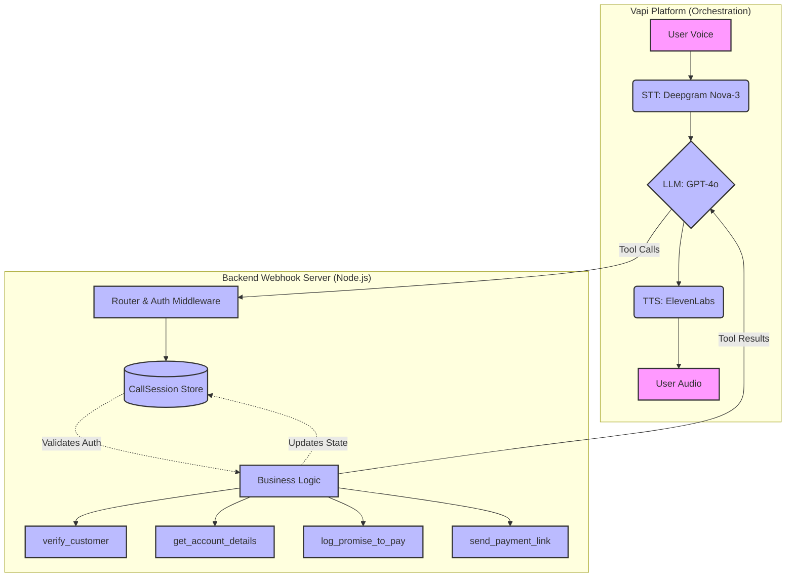

```mermaid
graph TD
    %% Telephony & Vapi Layer
    subgraph "Vapi Platform (Orchestration)"
        A[User Voice] --> B(STT: Deepgram Nova-3)
        B --> C{LLM: GPT-4o}
        C --> D(TTS: ElevenLabs)
        D --> E[User Audio]
    end

    %% Webhook Server Layer
    subgraph "Backend Webhook Server (Node.js)"
        C -- Tool Calls --> F[Router & Auth Middleware]
        F --> G[(CallSession Store)]
        
        %% State transition
        G -.->|Validates Auth| H[Business Logic]
        H -.->|Updates State| G
        
        %% API Endpoints
        H --> I[verify_customer]
        H --> J[get_account_details]
        H --> K[log_promise_to_pay]
        H --> L[send_payment_link]
    end
    
    %% Return Path
    H -- Tool Results --> C

    classDef external fill:#f9f,stroke:#333,stroke-width:2px;
    classDef internal fill:#bbf,stroke:#333,stroke-width:2px;
    class A,E external;
    class B,C,D,F,G,H,I,J,K,L internal;
```
